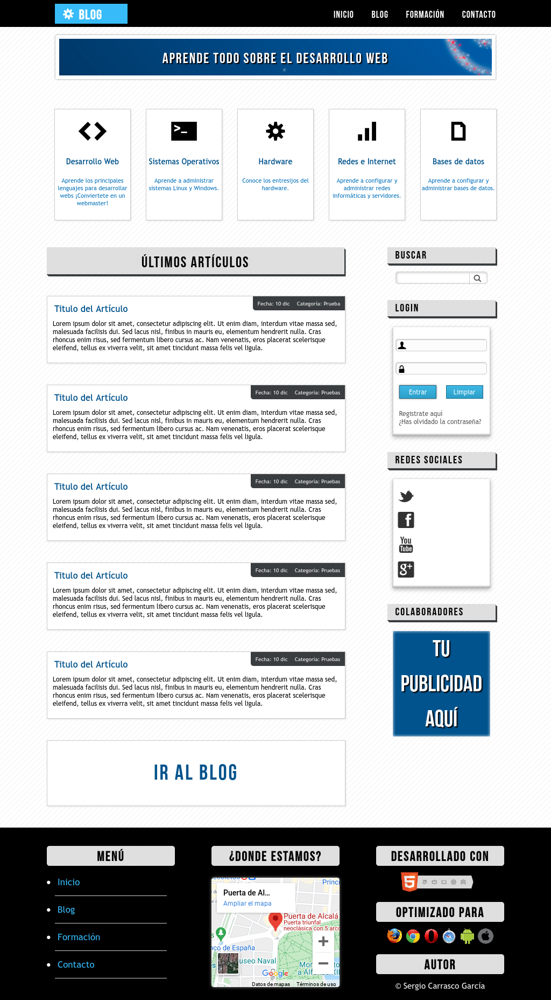

# Developer Blog
---
## What is Developer Blog? 🤔

We are talking about a responsive web layout with animations built based on a design of a jpg image. HTML5 and CSS3 are used. In the desktop version all animations are active, in responsive designs some animations have been disabled.

---
## Technologies used 🛠️
- HTML
- CSS
- Visual Studio Code
- Git/Git Hub
---
## Do you want to see the application running? 🚀

 [Click here!](https://scarrasco85.github.io/developer-blog)

 ## Responsive Views 
#### Desktop view

---
